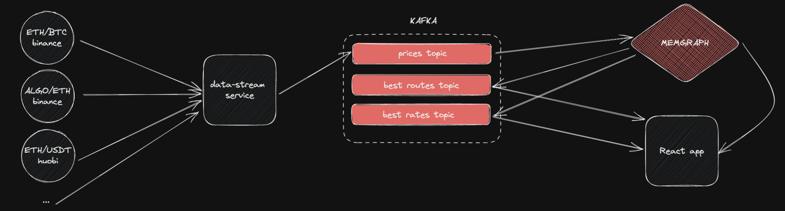

<h1 align="center">
  :panda_face: Challenge: Streaming Data Pipeline
</h1>

The CEDE Engineering Team appreciates your interest. The tasks from this repository are used for all levels of fullstack engineering roles.
Before to start, please read carefully the instructions below.

## :rocket: What is this challenge?
In this challenge you'll build a real-time streaming ETL pipeline using Kafka, Memgraph and time-series databases for CeFi prices :moneybag:

### Architecture view


### 1. Extract, Transform and Load prices data
- Push the data to Kafka (use `data-stream/prices_producer.py` for that).
- Write a transformation module to tell Memgraph how to consume the incoming messages (`memgraph/query_modules/exchange.py`).
- To test your module, you can use Memgraph UI on `localhost:3000` to run queries and visualize the graph.

### 2. Real-time graph analysis
In this part, you'll use the data you've loaded into Memgraph to answer some questions about the data.

1. Which exchange has the best rate for a given cryptocurrency pair to buy and sell?
  (e.g. `{pair: "BTC/USDT", rate: 17230, type: "buy", exchange: "binance"}` or 
`{pair: "BTC/USDT", rate: 17829, type: "sell", exchange: "huobi"}` )

2. What is the best route to exchange a given cryptocurrency pair?
  (e.g. ALGO -> ETH -> BTC -> USDT on Binance, ALGO -> USDT on Kucoin, etc.)

To answer these questions, you'll have to implement a custom query module in Memgraph [in Python, C or C++](https://memgraph.com/docs/memgraph/2.4.0/reference-guide/query-modules).
For the second question, you can use the Bellman-Ford algorithm [check here](https://www.thealgorists.com/Algo/ShortestPaths/Arbitrage) or [here](https://www.ericautry.com/uploads/1/2/7/7/127731023/algs_bellmanford_lecture_notes.pdf) to find the best route.

Once you've implemented the module, we need to trigger this query module 
on each price update event and push query results to Kafka (topics `best_rate` and `best_route`).
To implement it rapidly, check:
- backend/server/setup.py in [this repository](https://github.com/memgraph/twitter-network-analysis/blob/main/backend/server/setup.py) to add a trigger
- [Memgraph triggers](https://memgraph.com/docs/memgraph/2.4.0/reference-guide/triggers)

### 3.  React app
In this part, UI: create a simple React app with a store 
(Redux, Zustand, etc) for the graph and visualise it with D3 or any other library. To run the UI app, use Docker.


## :arrow_forward: Getting started

You can simply start the app by running:

```
docker-compose build
docker-compose up core // to start Kafka and Memgraph
docker-compose up data-stream // to start the stream
```

## How to submit code?
Please upload completed code to a personal git repository and share the link to your repository with us.